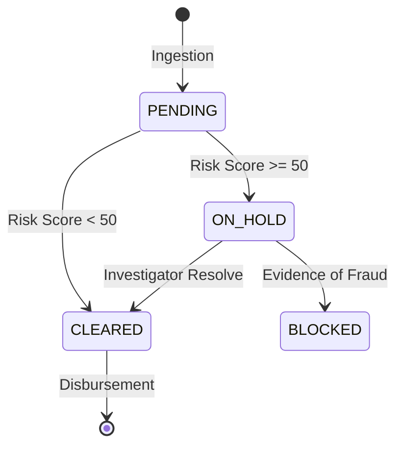

# Technical Architecture: SentinelGov v3.1

## 1. System Vision
SentinelGov is built on the principle of **Procedural Integrity**. The architecture ensures that every financial commitment is backed by a verified economic justification, with automated guardrails to prevent unauthorized releases.

## 2. Multi-Layered Intelligence Engine
The brain of the system is the `AnomalyEngine` in `backend/app/detection.py`. It operates in three distinct layers to ensure accuracy and reduce false positives.

### Layer 1: Deterministic Rules (0-50 pts)
- **Rank Violation**: Implements a strict penalty for awarding to non-L1 bidders.
  - Rank 2: +10 pts
  - Rank 3: +25 pts
  - Rank 4+: +50 pts (Immediate Critical)
- **Spread Analysis**:
  - `Spread = (Winning - Lowest) / Lowest`
  - >15%: +25 pts
  - >30%: +50 pts
- **Budget Compliance**:
  - >10% over: +10 pts
  - >20% over: +20 pts

### Layer 2: Statistical Anomaly Detection (0-50 pts)
- **Condition**: Only triggers if `num_bidders >= 5` to ensure statistical significance.
- **Z-Score Logic**: Calculates the absolute Z-score of the winning bid relative to the bid cluster. A Z-score > 1.5 contributes linearly to the risk (e.g., Z-score 2.0 = 30 pts).

### Layer 3: Behavioral ML Support (0-20 pts)
- **Vendor Velocity**: Monitors how frequently a vendor wins tenders across the entire system.
- **Trigger**: Win frequency > 40% adds +10 pts, signaling potential vendor-lock or capture.

---

## 3. The "Secured Layer" Workflow
The system enforces a strict state machine for all financial transactions:

### Data Flow Path
1. **Ingest**: `main.py` receives CSV/JSON data.
2. **Features**: `detection.py` computes the graph features (Rank, Spread, etc.).
3. **Score**: The Locked Scoring Formula computes the `final_risk_score`.
4. **Guard**: If Score > 50, the `Transaction` status is set to `ON_HOLD` before any user sees it.
5. **Enforcement**: Dashboard updates the **Risk Exposure** and **Payments on Hold** KPIs.

---

## 4. Frontend Resilience Architecture
The React frontend is designed for high-availability governance:
- **Zustand Store**: The `useStore.js` acts as a local cache of the backend's "Single Source of Truth".
- **Validation Engine**: The `invalidateState()` function ensures that any change in the backend (e.g., a "Freeze" action) is immediately reflected across all KPI cards, lists, and graphs simultaneously.
- **Secured Error Boundary**: A specialized component that catches runtime errors and provides a recovery path that preserves the "Secure Link" status for auditors.

---

## 5. Security & Cryptography
- **Identity Mocking**: Header-based RBAC simulating a government intranet.
- **Audit Logging**: Every action creates an `ActionLog` entry with a unique SHA-256 integrity hash, preventing log tampering.
- **Transparency**: The `/api/public/transparency` endpoint allows external auditors to verify hashes of sanctioned records without accessing private internal data.

*Drafted for Technical Stakeholder Review.*
