# National Procurement Integrity Shield (SentinelGov)

## 1. Product Overview
SentinelGov is an enterprise-grade intelligence platform designed for government-scale oversight of public spending and procurement. The platform serves as a "Command Center" for auditors, investigators, and compliance officers, providing a centralized interface to monitor, detect, and investigate financial anomalies with forensic precision. By transforming complex data streams into actionable intelligence, SentinelGov empowers institutional stakeholders to identify fraud, waste, and abuse before they escalate into systemic failures.

**Mission Statement:** To ensure institutional integrity and fiscal accountability through deterministic monitoring and transparent intelligence.

**Target Users:**
- **Federal Auditors:** For high-level fiscal oversight and GDP-relative risk monitoring.
- **Investigative Officers:** For deep-dive entity profiling and pattern recognition.
- **Compliance Managers:** For real-time policy enforcement and regulatory alignment.

**The Problem:** Existing procurement systems often operate in silos, relying on manual reviews or black-box AI that lacks explainability. Traditional audits are reactive, occurring months after the fact, which leads to irreparable loss of public funds and erosion of trust.

**The Solution:** SentinelGov provides a proactive, deterministic monitoring layer that bridges the gap between raw data and judicial-grade evidence, enabling immediate intervention in suspicious transaction flows.

---

## 2. System Philosophy

### Trust-First Design
In a government environment, transparency is paramount. The platform is built on the principle that every system action must be traceable, justifiable, and immutable.

### Deterministic Intelligence
Unlike traditional AI that can produce probabilistic "hallucinations," SentinelGov utilizes deterministic scoring logic for its core detection engine. A risk score is not a guess; it is a mathematical derivative of specific, documented violations (e.g., structuring, fuzzy-matched duplication, or off-hours approvals).

### Explainable Anomaly Detection
Every alert generated by the system comes with an "Intelligence Brief," explaining exactly *why* the entity was flagged, citing the specific rules violated and the evidence found.

### Audit Admissibility
Every action within the platform—from a vendor freeze to a case escalation—is hashed and recorded in an immutable ledger, ensuring the system state can be forensically reconstructed for legal proceedings.

### Defense-Grade UI Principles
The interface is designed for long-duration analytical sessions. It prioritizes high information density, low eye strain (dark theme), and rapid tactical awareness through military-inspired SOC aesthetics.

---

## 3. Platform Architecture (Frontend-Only)

This repository currently implements a **fully functional frontend system** designed to simulate complex intelligence workflows. It serves as a visual and architectural blueprint for a complete GovTech solution.

- **Frontend Core:** Built with **React** and **Vite** for zero-latency UI responsiveness.
- **Styling Layer:** **Tailwind CSS** with a custom design system focused on high-density data visualization and SOC aesthetics.
- **State Management:** **Zustand** for centralized, predictable global state across multi-page workflows.
- **Routing Strategy:** **React Router** for seamless navigation between the 10+ specialized system modules.
- **Data Visualization:** **Recharts** for rendering high-fidelity expenditure baselines and transaction velocity graphs.
- **Security Simulation:** Integrated SHA-256 hashing simulations and clearance-level logic to demonstrate the immutable ledger philosophy.

> “This repository currently implements a fully functional frontend system. Backend services, AI inference engines, and production data pipelines will be added in future iterations.”

---

## 4. Tech Stack

| Technology | Role | Rationale |
| :--- | :--- | :--- |
| **React (Vite)** | Core Framework | Selected for its component-based architecture and extremely fast development/build cycles. Alternative (CRA) was rejected due to performance bottlenecks. |
| **Tailwind CSS** | Design System | Chosen for its utility-first approach, allowing for the rapid implementation of a custom "government-grade" aesthetic without the bloat of traditional CSS frameworks. |
| **Zustand** | State Management | Prioritized for its minimal boilerplate and ease of use compared to Redux, enabling responsive updates to system-wide status and notifications. |
| **Recharts** | Visual Analytics | Best-in-class for React-based SVG charts, providing the necessary precision and responsiveness for expenditure monitoring. |
| **Lucide React** | Tactical Iconography | Provides a clean, consistent set of professional icons that align with the platform's serious aesthetic. |

---

## 5. Page-by-Page Documentation

### Secure Entry / Authentication Page
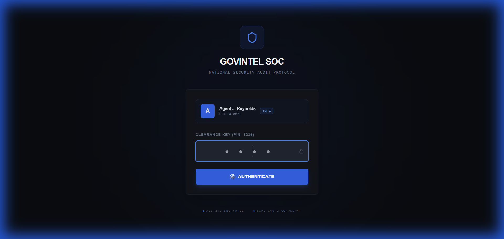
*Caption: The primary gateway for authorized personnel, featuring a PIN-based simulation and clearance verification.*
- **Purpose:** Controls system access and establishes the user's initial clearance level (L1-L5).
- **Security:** Simulates a secure, hardware-token-compatible entry point.

### System Overview Dashboard
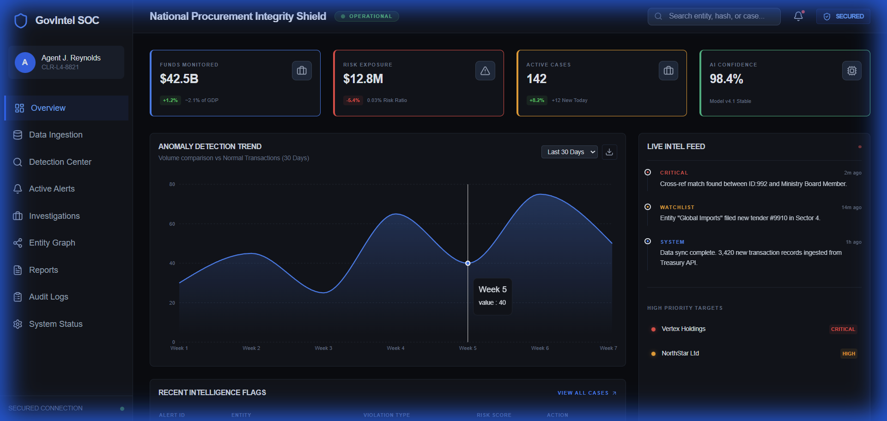
*Caption: Tactical Command Center displaying high-level KPIs, anomaly trends, and a live intelligence feed.*
- **Key Actions:** Monitor real-time risk exposure and view the live intelligence feed.
- **Data Shown:** Funds monitored vs. risk ratio, AI confidence stability, and priority targets.

### Data Ingestion Protocol
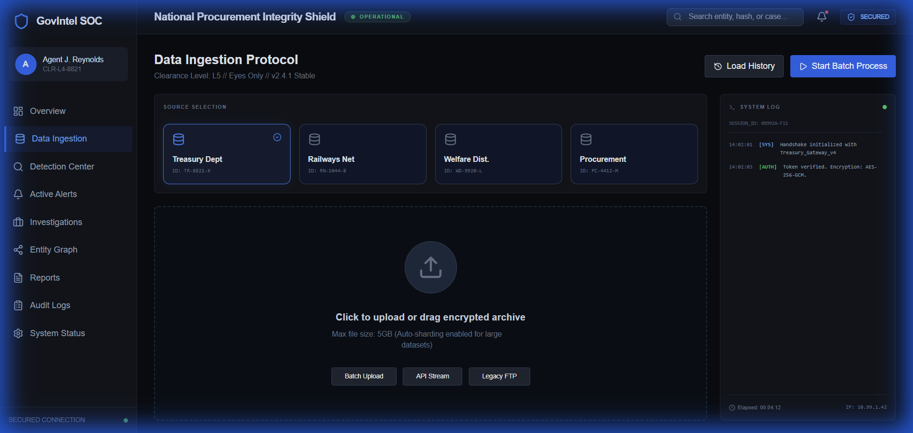
*Caption: The protocol interface for ingesting encrypted transaction batches from external government gateways.*
- **User Actions:** Selection of data sources (Treasury, Railways, etc.) and initiation of batch processing.
- **Security:** Visualizes ingestion integrity and cryptographic block commits.

### Detection Center
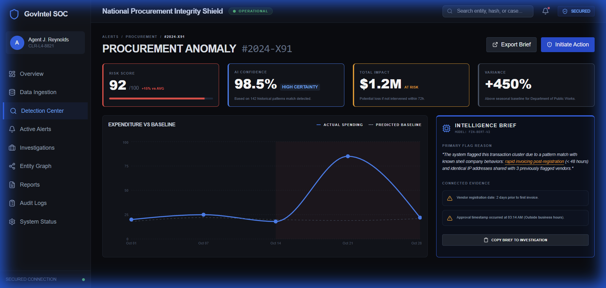
*Caption: Deep analytical view of a flagged procurement anomaly, showing variance from baseline spending.*
- **Purpose:** Provides a forensic breakdown of a specific alert, enabling the user to "Initiate Action."
- **Data Shown:** Risk scores, baseline expenditure variance chart, and AI Intelligence Brief.

### Active Alerts Feed
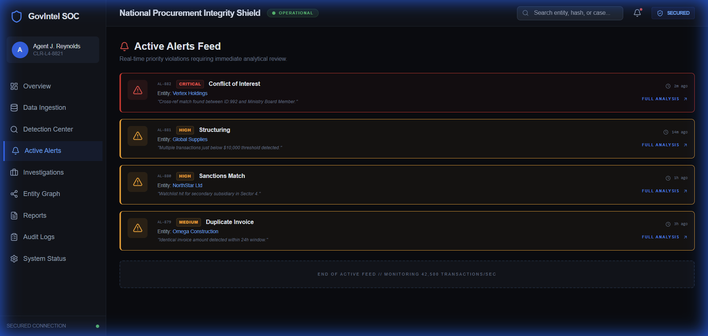
*Caption: Real-time priority stream of system-wide violations and critical intelligence flags.*
- **Workflow:** Allows operators to rapidly triage new alerts based on severity and violation type.

### Investigation Cases
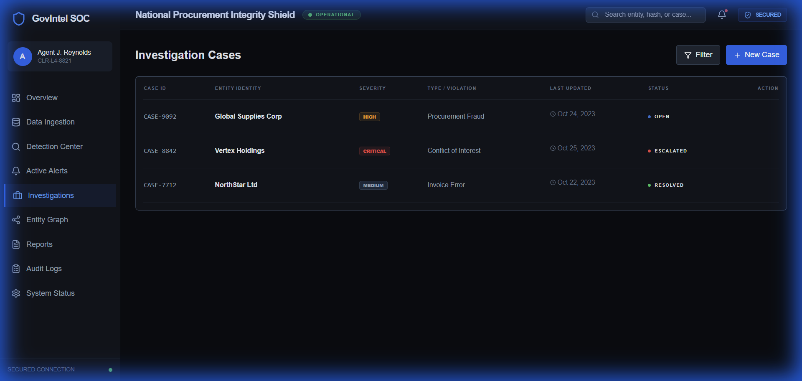
*Caption: Central repository of all open, escalated, and resolved investigation files.*
- **Usage:** Serves as the primary workspace for investigators to track ongoing dossiers and their current status.

### Individual Case Analysis
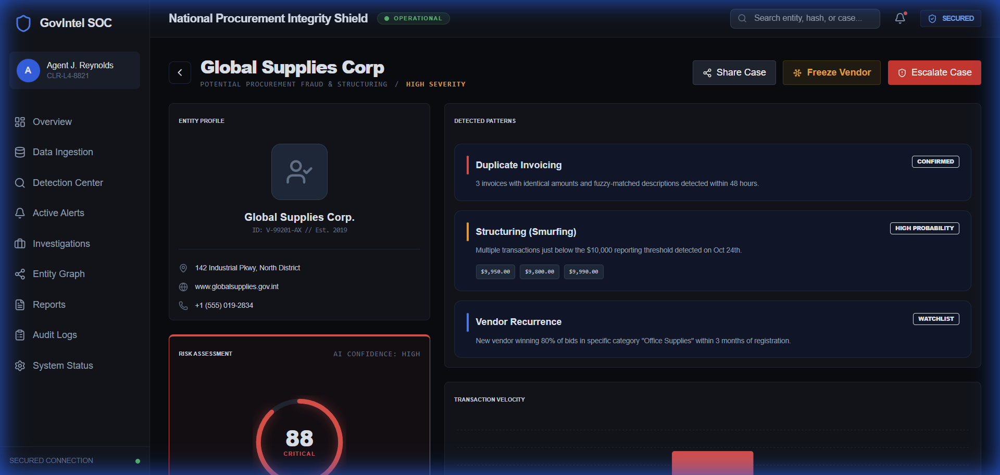
*Caption: Deep entity profile for Global Supplies Corp, showing transaction velocity and detected fraud patterns.*
- **Actions:** Freeze Vendor, Escalate Case, and Copy Brief to Investigation.
- **Data Shown:** Transaction smurfing patterns, recurrence analysis, and flagged payment history.

### Entity Relationship Graph
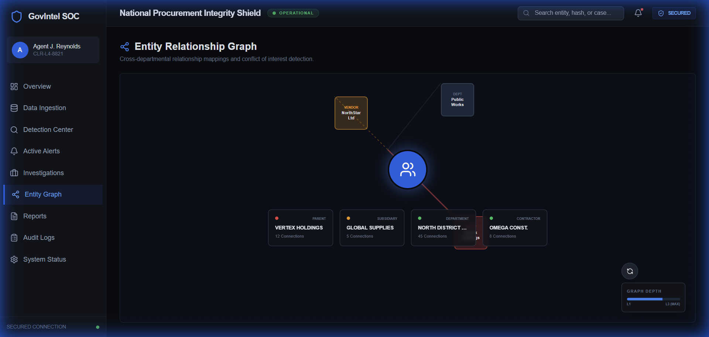
*Caption: Conflict of Interest (CoI) detection graph showing relationships between entities and government departments.*
- **Purpose:** Visualizes multi-hop connections to identify shell companies and hidden stakeholder links.

### Reports & Exports Management
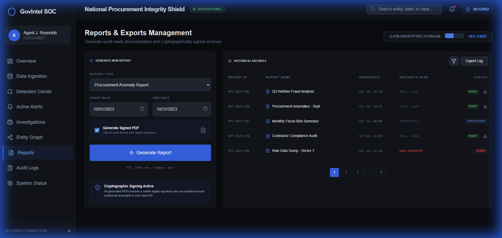
*Caption: Archive management for generating cryptographically signed audit reports.*
- **Key Features:** Signed PDF generation, integrity hash tracking, and historical archive access.

### Immutable Audit Logs
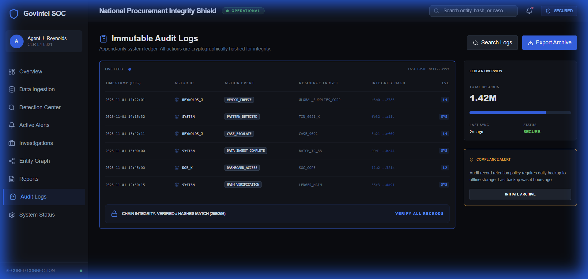
*Caption: The append-only system ledger recording every user and system action for forensic verification.*
- **Philosophy:** Transparent traceability of system state, simulating a blockchain-inspired integrity chain.

### System Settings & Model Governance
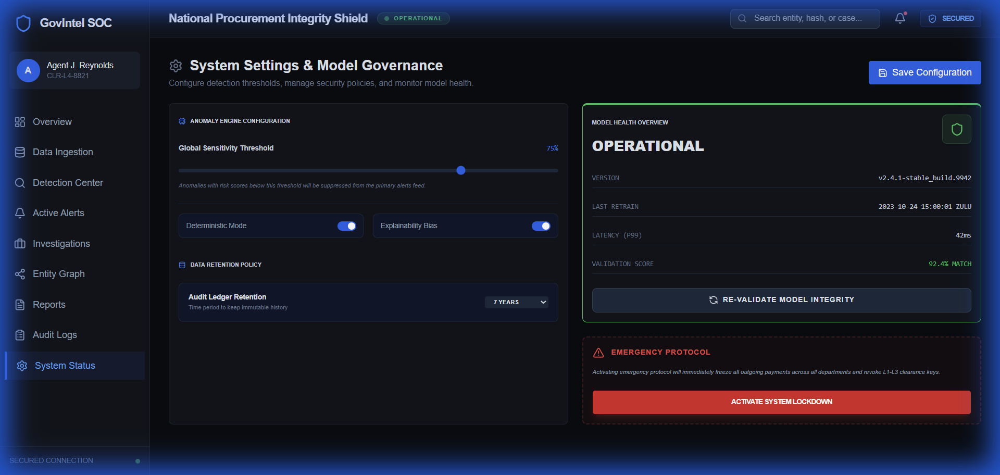
*Caption: Governance interface for configuring the Anomaly Engine and activating Emergency Protocols.*
- **Key Controls:** Sensitivity threshold slider, model health metrics, and the "System Lockdown" button.

---

## 7. Security & Compliance Model (Simulated)
SentinelGov implements a visual security model based on traditional SOC architectures:
- **Clearance Levels:** UI visibility and action capabilities are tied to mock clearance levels (e.g., L5 access required for Emergency Protocol).
- **Append-Only Logs:** The system simulates an immutable audit trail using SHA-256 hash visualization.
- **Deterministic Logic:** All risk calculations use fixed multipliers (Structuring +20, Duplicate +25), ensuring consistent results for judicial review.

---

## 8. AI & Anomaly Detection Philosophy
The platform avoids "black-box" AI in favor of a **Deterministic Intelligence Model**:
1. **Rule-Based Scoring:** Specific patterns (e.g., invoices just below $10,000) trigger fixed risk assignments.
2. **Explainability-First:** Each alert *must* include the logical derivation of its score.
3. **Reproducibility:** Auditors must be able to reproduce any system flag using the same raw data and the system's versioned ruleset.

---

## 9. Future Roadmap
- **Phase 1 (Current):** Interactive Frontend Prototype & Aesthetic 3.0.
- **Phase 2 (Planned):** FastAPI Backend services with PostgreSQL for persistent storage.
- **Phase 3 (Expansion):** Real-time data stream connectors and AI inference engine (Python-based).
- **Phase 4 (Enterprise):** Role-Based Access Control (RBAC) with OAuth2 and military-grade encryption.

---

## 10. Demo & Usage Instructions

### Local Environment Setup
1. Clone the repository: `git clone https://github.com/evildead23151/SentinelGov.git`
2. Navigate to the frontend: `cd frontend`
3. Install dependencies: `npm install`
4. Launch the platform: `npm run dev`

### Navigating the Demo
1. **System Entry:** Authenticate using the universal test PIN: **1234**.
2. **Dashboard Overview:** Monitor the live feed and note any high-priority alerts.
3. **Data Ingest:** Go to "Data Ingestion" and trigger a mock batch process.
4. **Investigation:** Navigate to "Investigations" and select a case file to perform a "Vendor Freeze."
5. **Audit:** Visit "Audit Logs" to verify your actions have been recorded in the immutable ledger.

---

## 11. Disclaimer
This platform is a **prototype / educational system** developed as a proof-of-concept for government-scale intelligence monitoring. It has no affiliation with any real government body. All intelligence work and data seen in the platform are simulations designed to demonstrate SOC-grade analytical workflows.
